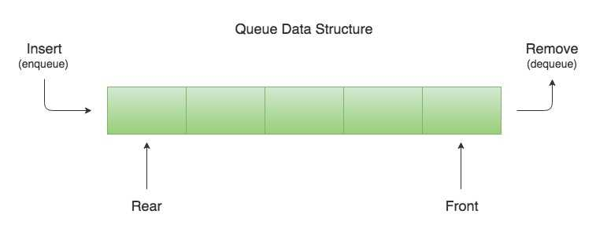
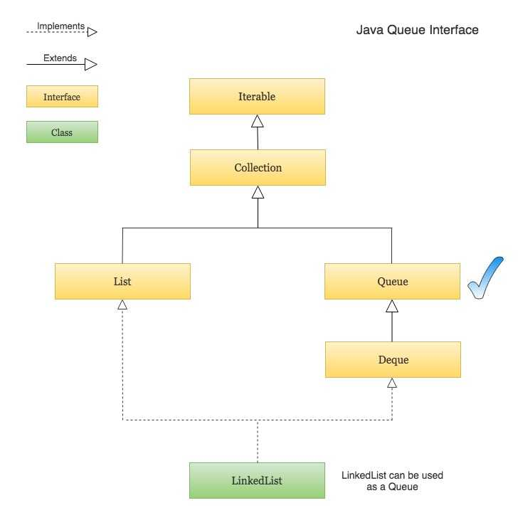

# Java Queue

큐는 선입선출(FIFO: First-In-First-Out)의 특성을 가진 자료구조. 
이는 큐에 들어간 첫 번째 요소가 먼저 나온다는 것을 의미함. 
네트워킹, 운영체제의 태스크 관리, 프린터의 작업 대기열 등 다양한 분야에서 활용.

# [ 컬렉션에서 큐의 위치 ]

# [ 특징 ]

1. 자바에서는 큐를 구현하기 위해 주로 java.util.Queue 인터페이스를 사용. Queue 인터페이스는 다음과 같은 주요 메소드를 제공
    - offer(e): 요소 e를 큐에 삽입. 공간이 부족하여 추가할 수 없는 경우 false를 반환.
    - poll(): 큐의 첫 번째 요소를 제거하고 반환. 큐가 비어있으면 null을 반환.
    - peek(): 큐의 첫 번째 요소를 제거하지 않고 반환. 큐가 비어있으면 null을 반환.
    - add(e): offer(e)와 유사하지만, 요소를 삽입할 수 없을 때 예외 발생.
    - remove(): poll()과 유사하지만, 큐가 비어있을 때 예외 발생.
    - element(): peek()과 유사하지만, 큐가 비어있을 때 예외 발생.

2. 큐를 구현하는 대표적인 클래스들
    - LinkedList: java.util.LinkedList 클래스는 Queue 인터페이스를 구현하고 있으며, 큐의 기능 뿐만 아니라 리스트의 기능도 제공. 내부적으로 이중 연결 리스트로 구현되어 있어서 요소의 추가와 제거가 빠르다.
    - PriorityQueue: 우선순위 큐는 요소들이 자연 순서 또는 별도의 Comparator에 의해 정렬되는 큐. PriorityQueue는 이진 힙으로 구현되어 있어서 삽입과 삭제 연산이 효율적이다.
    - ArrayDeque: 이 클래스는 배열 기반의 양방향 큐(Deque)를 구현. ArrayDeque는 스택과 큐의 기능을 모두 제공하며, 내부적으로는 동적 배열로 구현되어 있음

3. 큐 는 여러 요소를 순차적으로 처리해야 할 때 매우 유용함. 예를 들어, BFS(너비 우선 탐색) 알고리즘에서는 탐색 순서를 관리하기 위해 큐가 자주 사용됨.

4. 주의사항
    - 큐는 멀티스레드 환경에서 동시성 문제를 일으킬 수 있으므로, java.util.concurrent 패키지의 스레드-세이프한 큐 구현체들(예: ConcurrentLinkedQueue, BlockingQueue의 구현체들)을 사용하는 것
      이 고려해야 함
    - add, remove, element 메소드들은 실패시 예외를 발생하므로 예외 처리를 해줘야함